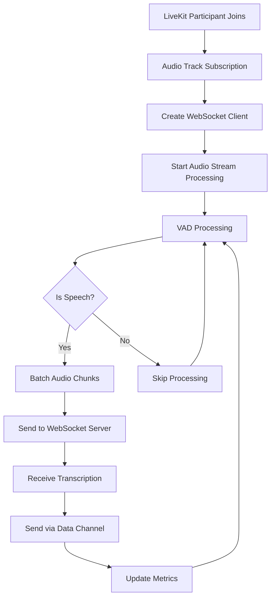
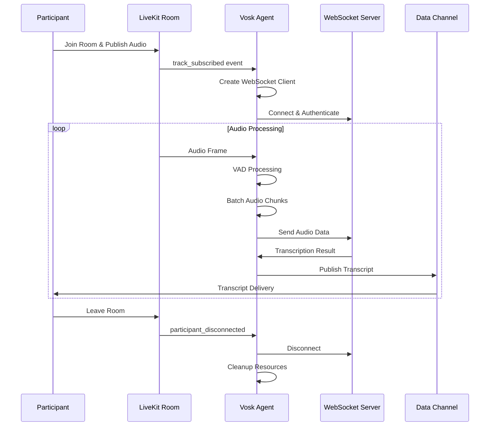

# Vosk Transcription Agent - Architecture Overview & Guidelines

## 1. Project Overview / Introduction

### 1.1 Project Description
**Vosk Transcription Agent** is a real-time system for converting speech to text (speech-to-text) used in LiveKit environments. The project integrates Voice Activity Detection (VAD) technology and WebSocket to process audio from multiple participants simultaneously.

### 1.2 Main Objectives
- **Real-time transcription**: Convert speech to text in real-time
- **Multi-participant support**: Support multiple speakers simultaneously in one room
- **High accuracy**: Use Vosk engine to ensure high accuracy
- **Scalable architecture**: Design with scalability using thread-safe operations
- **Resource optimization**: Efficient resource management with buffer pooling and circuit breaker

### 1.3 Project Scope
- **Input**: Audio streams from LiveKit room participants
- **Processing**: Voice Activity Detection, audio preprocessing, batch processing
- **Output**: Transcribed text via LiveKit data channels
- **Integration**: Seamless integration with LiveKit platform
- **Monitoring**: Comprehensive metrics and logging

## 2. Architecture Document

### 2.1 Overall Architecture

```
┌─────────────────┐    ┌──────────────────┐    ┌─────────────────┐
│   LiveKit       │    │  Vosk Agent      │    │  WebSocket      │
│   Participants  │◄──►│  (Main Process)  │◄──►│  Transcription  │
│                 │    │                  │    │  Server         │
└─────────────────┘    └──────────────────┘    └─────────────────┘
                                │
                                ▼
                       ┌──────────────────┐
                       │   Data Channel   │
                       │   (Transcript    │
                       │    Results)      │
                       └──────────────────┘
```

### 2.2 Core Components

#### 2.2.1 Agent Manager
- **Function**: Manage agent identity, metadata, and state
- **Responsibilities**:
  - Setup agent identity in LiveKit room
  - Announce agent ready status
  - Handle agent commands from data channel
  - Monitor agent health and status

#### 2.2.2 Event Handlers
- **Function**: Handle events from LiveKit room
- **Events handled**:
  - Track subscription/unsubscription
  - Participant connection/disconnection
  - Audio stream management

#### 2.2.3 Audio Processing Pipeline
- **VAD Processor**: Voice Activity Detection with ZCR filtering
- **Audio Buffer Management**: Thread-safe buffer operations
- **Stream Processing**: Real-time audio chunk processing

#### 2.2.4 WebSocket Client
- **Function**: Connect to Vosk transcription server
- **Features**:
  - Circuit breaker pattern
  - Auto-reconnection
  - Batch processing
  - Rate limiting

#### 2.2.5 Transcript Manager
- **Function**: Manage transcript output
- **Features**:
  - Data channel communication
  - Sequence management
  - Participant tracking

## 3. System Design / Technical Specs

### 3.1 Main Processing Flow



### 3.2 Audio Processing Architecture

```
┌─────────────────┐    ┌─────────────────┐    ┌─────────────────┐
│   Raw Audio     │    │   VAD           │    │   Batching      │
│   Stream        │───►│   Processing    │───►│   & Buffering   │
│   (10ms chunks) │    │   (30ms window) │    │   (50ms batch)  │
└─────────────────┘    └─────────────────┘    └─────────────────┘
                                │
                                ▼
                       ┌─────────────────┐
                       │   WebSocket     │
                       │   Transmission  │
                       └─────────────────┘
```

### 3.3 Thread-Safe Components

#### 3.3.1 Audio Queue System
```python
ThreadSafeQueue -> AudioQueue -> ProcessingPipeline
```

#### 3.3.2 Buffer Pool Management
```python
AudioBufferPool -> ManagedResource -> ResourceStats
```

#### 3.3.3 Metrics Collection
```python
MetricsService (Singleton) -> MetricWindow -> MetricPoint
```

### 3.4 Configuration Management

#### 3.4.1 Audio Configuration
- **Sample Rate**: 16000 Hz (configurable)
- **Channels**: 1 (mono)
- **Chunk Duration**: 10ms
- **Analysis Window**: 30ms (with 20ms overlap)
- **Batch Size**: 3-5 chunks

#### 3.4.2 VAD Configuration
- **ZCR Thresholds**: (0.05, 0.3)
- **Energy Threshold**: 0.005
- **Moving Average Window**: 16 frames
- **Minimum Speech Frames**: 15
- **Silent Threshold**: 500ms

#### 3.4.3 WebSocket Configuration
- **Host**: 0.0.0.0
- **Port**: 8000
- **Reconnect Attempts**: 5
- **Connection Timeout**: 10s
- **Batch Size**: 10 chunks

### 3.5 Error Handling & Resilience

#### 3.5.1 Circuit Breaker Pattern
```python
CircuitBreakerConfig(
    failure_threshold=5,
    reset_timeout=30.0,
    half_open_timeout=5.0
)
```

#### 3.5.2 Error Classification
- **LOW**: Minor issues, continue processing
- **MEDIUM**: Significant issues, retry logic
- **HIGH**: Serious issues, immediate attention
- **CRITICAL**: System-breaking issues

#### 3.5.3 Resource Management
- **Buffer Pooling**: Reuse audio buffers
- **Connection Pooling**: WebSocket connection management
- **Memory Management**: Automatic cleanup and garbage collection

### 3.6 Monitoring & Metrics

#### 3.6.1 Audio Metrics
- Processing time per chunk
- Speech detection accuracy
- Buffer utilization
- Queue sizes

#### 3.6.2 Network Metrics
- WebSocket connection status
- Reconnection attempts
- Data throughput
- Latency measurements

#### 3.6.3 System Metrics
- CPU usage
- Memory consumption
- Thread pool utilization
- Error rates

### 3.7 API Flow Diagram



### 3.8 Data Models

#### 3.8.1 Audio Chunk
```python
@dataclass
class AudioChunk:
    data: np.ndarray
    is_speech: bool
    timestamp: float
    chunk_id: int
```

#### 3.8.2 Transcript Entry
```python
transcript_entry = {
    "participantIdentity": str,
    "participantName": str,
    "seq": int,
    "isFinal": bool,
    "language": str,
    "text": str,
    "segments": list,
    "timestamp": int
}
```

#### 3.8.3 Agent Metadata
```python
agent_metadata = {
    "type": "agent",
    "role": "transcription",
    "service": "vosk",
    "provider": "websocket",
    "version": "1.0.0",
    "capabilities": [...],
    "status": "ready",
    "features": {...}
}
```

### 3.9 Deployment Considerations

#### 3.9.1 Environment Variables
- Audio processing parameters
- WebSocket server configuration
- Logging levels
- Performance tuning parameters

#### 3.9.2 Resource Requirements
- **CPU**: Multi-core for concurrent processing
- **Memory**: 1-2GB for buffer management
- **Network**: Stable connection to Vosk server
- **Disk**: Space for logs and temporary files

#### 3.9.3 Scalability
- Horizontal scaling with multiple agent instances
- Load balancing across WebSocket servers
- Resource pooling for efficiency
- Monitoring and auto-scaling capabilities

## 4. Development Guidelines

### 4.1 Code Structure
- **Modular design** with clear separation of concerns
- **Thread-safe operations** for concurrent processing
- **Comprehensive error handling** with proper logging
- **Configuration-driven** behavior
- **Extensive metrics** collection

### 4.2 Testing Strategy
- Unit tests for individual components
- Integration tests for end-to-end flows
- Performance tests for scalability
- Error injection tests for resilience

### 4.3 Future Enhancements
- **Multi-language support**: Extend beyond Vosk
- **Real-time translation**: Add translation capabilities
- **Enhanced VAD**: Machine learning-based VAD
- **Cloud deployment**: Kubernetes orchestration
- **Analytics dashboard**: Real-time monitoring UI